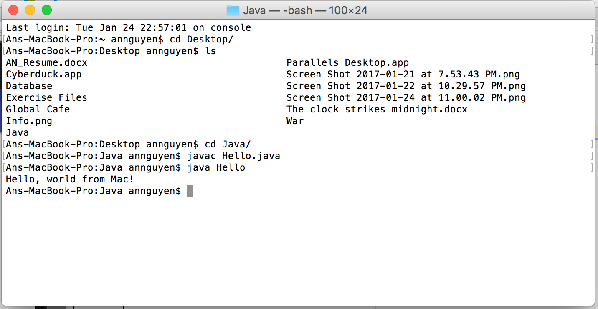
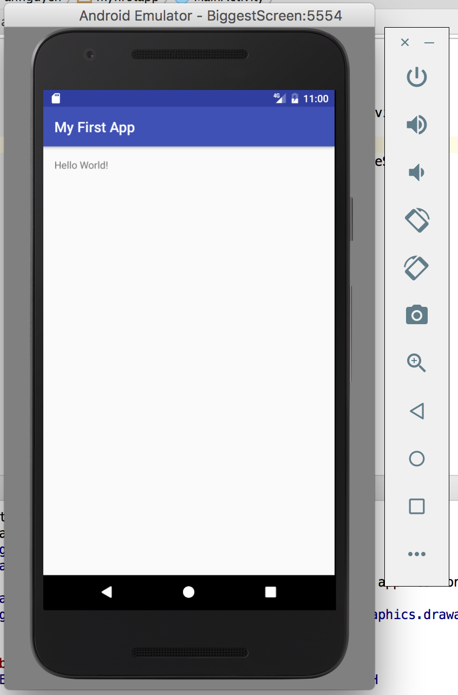

# Contacts

## An Nguyen

#### Git commands w/short descriptions:

1. git init: creates new local repository with specified name
2. git status: lists all new or modified files to be committed
3. git add: snapshots the file in preparation in versioning
4. git commit: records file snapshots permanently in version history
5. git push: uploads all history from the repository bookmark
6. git pull: downloads bookmark history and incorporates changes
7. git rm: deletes the file from the working directory and stages the deletion

#### Screenshots:
>This app provides business contact information in an address book. Create three screens for contacts for the app. Use the app to select a particular contact, and then display that person’s information.

*Screenshot of JDK running java.hello*:

*Screenshot of Android Studio - My First App*:

*Screenshot of Contacts App*:

![Contacts App] (images/3.png)

*Screenshot of when button clicked*:

![Contacts App2] (images/4.png)

