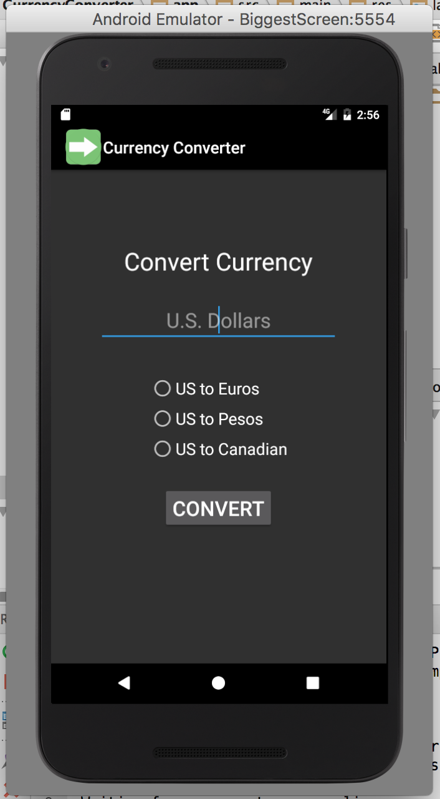
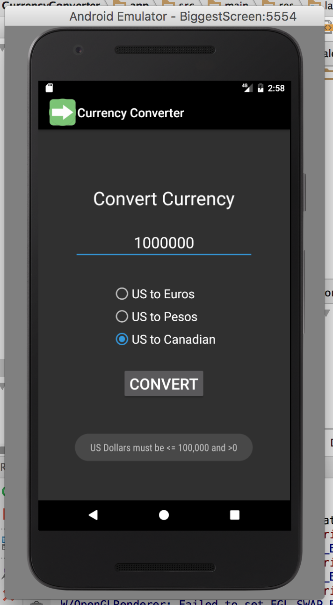
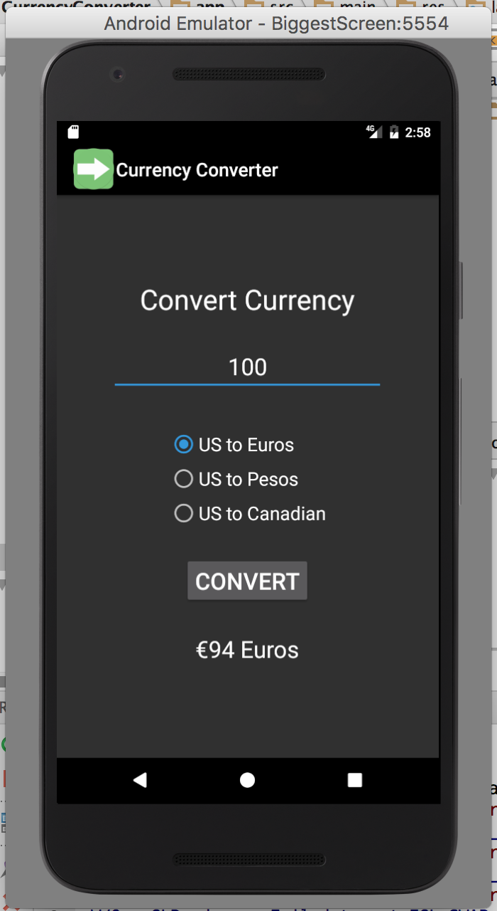

# Currency Converter

## An Nguyen

### Requirements:

1. Field to enter U.S. dollar amount: 1 – 100,000
2. Must include toast notification if user enters out-of-range values
3. Radio buttons to convert from U.S. to Euros, Pesos and Canadian currency (must be vertically
and horizontally aligned)
4. Must include correct sign for euros, pesos, and Canadian dollars
5. Must add background color(s) or theme
6. Create and display launcher icon image

#### Screenshots:

*Screenshot of running application's unpopulated user interface*:

*Screenshot of running application's toast notifaction*:

*Screenshot of running application's converted currency user interface*:

