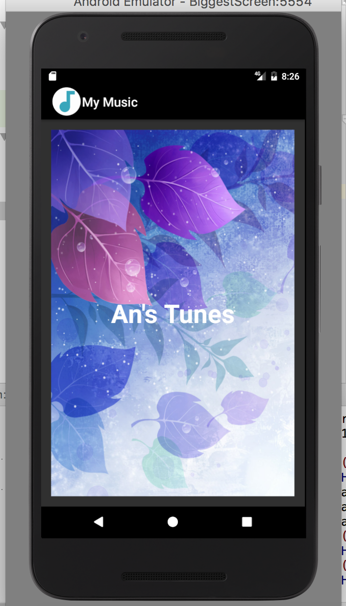
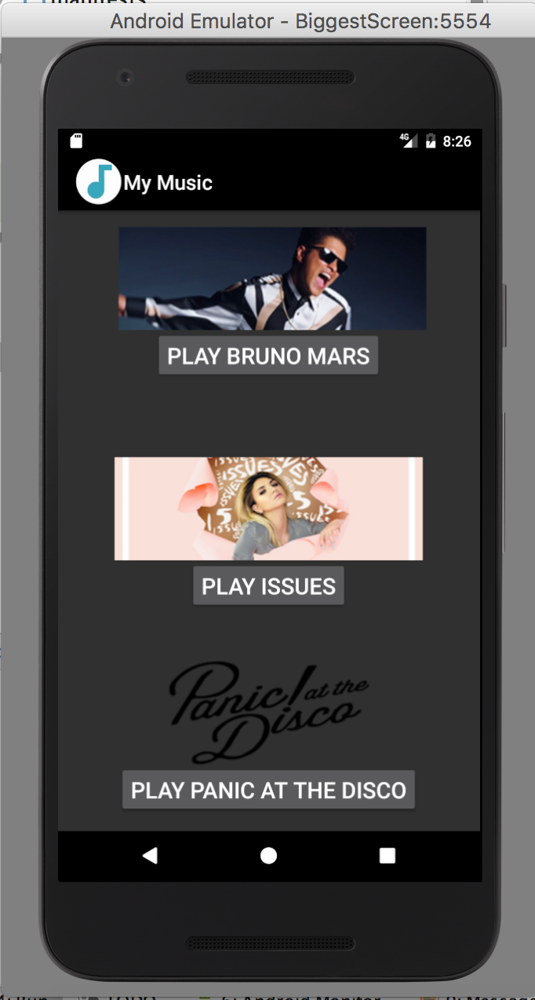
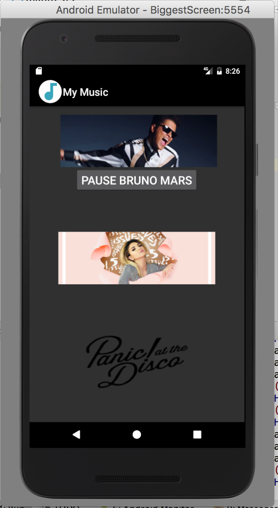
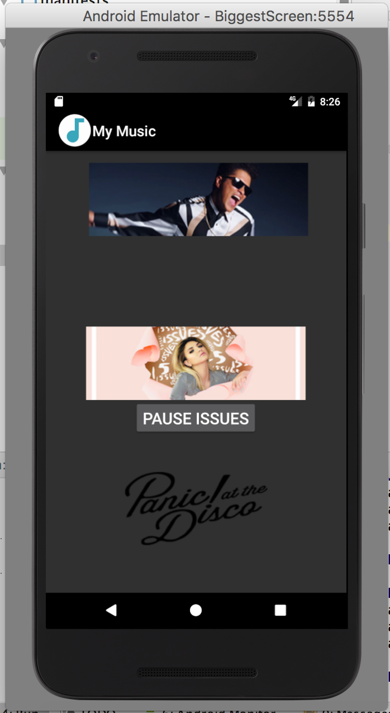

# Music Playlist

## An Nguyen

### Requirements:

> Create a music playlist app to play different types of songs

1. Include splash screen image, app title, intro text.
2. Include artists’ images and media.
3. Images and buttons must be vertically and horizontally aligned.
4. Must add background color(s) or theme
5. Create and display launcher icon image

#### Screenshots:

*Screenshot of splash screen*:

*Screenshot of follow-up screen*:

*Screenshot of play and pause interface of first song*:

*Screenshot of play and pause interface of second song*:

